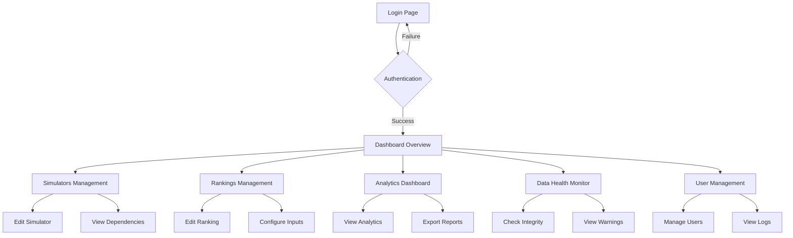

## 1. Product Overview

A dedicated admin dashboard for Educando Seu Bolso that provides administrators with centralized control over simulators, rankings, analytics, and data integrity monitoring. This standalone application enables efficient platform management without affecting the public blog/simulators experience.

The dashboard solves operational inefficiencies by providing real-time insights, data management tools, and health monitoring for the financial education platform used by thousands of users daily.

## 2. Core Features

### 2.1 User Roles

| Role | Registration Method | Core Permissions |
|------|---------------------|------------------|
| Admin | Manual creation by super admin | Full access to all dashboard features, user management, system configuration |
| Maintainer | Admin invitation | Access to simulators management, analytics viewing, limited data editing |

### 2.2 Feature Module

Our admin dashboard requirements consist of the following main pages:

1. **Dashboard Overview**: System health summary, key metrics, recent activities, quick actions
2. **Simulators Management**: List all simulators, edit metadata, manage parameters, view dependencies
3. **Rankings Management**: Browse rankings, edit descriptions, configure inputs, monitor data sources
4. **Analytics Dashboard**: Page views, user flows, popular content, engagement metrics
5. **Data Health Monitor**: Integrity checks, missing data alerts, legacy dependency warnings
6. **User Management**: Admin user list, role assignments, activity logs

### 2.3 Page Details

| Page Name | Module Name | Feature description |
|-----------|-------------|---------------------|
| Dashboard Overview | System Health Widget | Display overall system status, active simulators count, recent errors, data freshness indicators |
| Dashboard Overview | Quick Stats | Show total page views, active rankings, data sources status, last sync timestamp |
| Dashboard Overview | Recent Activities | List recent admin actions, system alerts, data updates with timestamps |
| Simulators Management | Simulator List | Display all simulators with search, filter by status, data source, last updated |
| Simulators Management | Metadata Editor | Edit simulator titles, descriptions, categories, enable/disable status |
| Simulators Management | Parameters Manager | Configure input parameters, fees, taxes, validation rules, default values |
| Simulators Management | Data Dependencies | View which tables/fields power each simulator, identify legacy vs new database sources |
| Rankings Management | Rankings Browser | Browse all rankings with filters, sorting, status indicators |
| Rankings Management | Ranking Editor | Modify ranking titles, descriptions, highlights, display order |
| Rankings Management | Input Configuration | Manage ranking parameters, data sources, calculation formulas |
| Rankings Management | Source Mapping | Visualize data flow from database tables to ranking display |
| Analytics Dashboard | Page Analytics | View page views, unique visitors, time spent per page/simulator/ranking |
| Analytics Dashboard | User Flow Analysis | Track navigation patterns, entry/exit points, drop-off locations |
| Analytics Dashboard | Content Performance | Identify most accessed rankings, popular simulators, trending content |
| Analytics Dashboard | Export Reports | Generate and download analytics reports in CSV/JSON formats |
| Data Health Monitor | Integrity Checks | Scan for missing data, incomplete records, data type mismatches |
| Data Health Monitor | Legacy Warnings | Alert when rankings depend on legacy database fields |
| Data Health Monitor | Status Indicators | Show health status: healthy (green), partially hydrated (yellow), legacy-dependent (red) |
| Data Health Monitor | Data Sync Status | Monitor synchronization between new and legacy databases |
| User Management | Admin Users List | Display all admin users with roles, last login, activity status |
| User Management | Role Management | Assign/revoke permissions, create custom roles, manage access levels |
| User Management | Activity Logs | Track user actions, login history, permission changes |

## 3. Core Process

### Admin User Flow

Administrators access the dashboard through secure login, land on the overview page showing system health and key metrics. From there, they can navigate to specific management areas: simulators for content control, analytics for performance insights, data health for integrity monitoring, and user management for team administration.

### Maintainer User Flow

Maintainers have limited access, focusing on simulators and rankings management plus analytics viewing. They can edit metadata and parameters but cannot manage users or system configuration.

## 4. User Interface Design

### 4.1 Design Style

- **Primary Colors**: Deep blue (#1e40af) for primary actions, slate gray (#64748b) for secondary elements
- **Secondary Colors**: Green (#10b981) for healthy status, yellow (#f59e0b) for warnings, red (#ef4444) for errors
- **Button Style**: Rounded corners (8px radius), clear hover states, consistent sizing
- **Typography**: Inter font family, 14px base size, clear hierarchy with 1.25 ratio scaling
- **Layout**: Card-based design with generous whitespace, fixed sidebar navigation, responsive main content area
- **Icons**: Lucide React icons, consistent 20px size, monochrome with color accents for status

### 4.2 Page Design Overview

| Page Name | Module Name | UI Elements |
|-----------|-------------|-------------|
| Dashboard Overview | System Health Widget | Circular progress indicators, status badges, compact metric cards with trend arrows |
| Simulators Management | Simulator List | Data table with sortable columns, status pills, action dropdowns, search bar |
| Rankings Management | Ranking Editor | Form with labeled inputs, rich text editor for descriptions, preview panel |
| Analytics Dashboard | Page Analytics | Line charts for trends, bar charts for comparisons, date range picker, export buttons |
| Data Health Monitor | Integrity Checks | Alert cards with severity levels, expandable details, action buttons for fixes |
| User Management | Admin Users List | Avatar display, role badges, activity indicators, bulk action toolbar |

### 4.3 Responsiveness

Desktop-first design approach with mobile-responsive layouts. Main navigation collapses to hamburger menu on mobile, data tables become horizontally scrollable, charts adapt to screen size. Touch-optimized interactions for tablets and mobile devices.