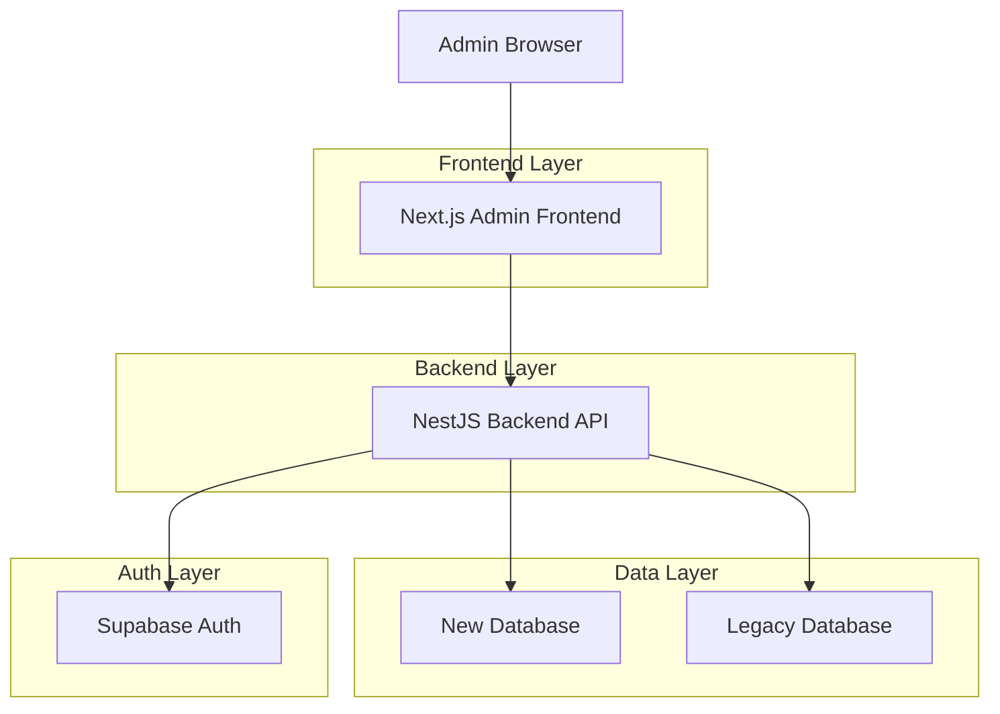
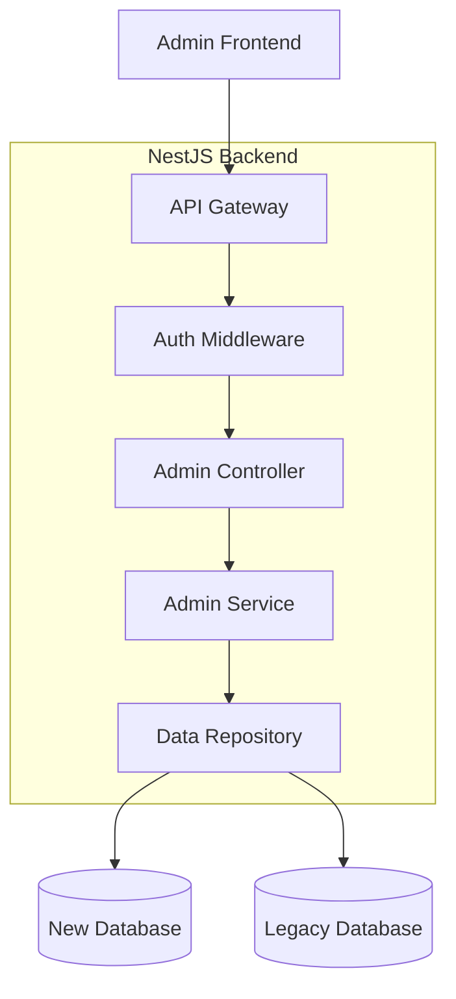
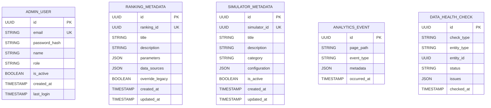

## 1. Architecture Design



## 2. Technology Description

- **Frontend**: Next.js@14 + TypeScript + Tailwind CSS + Shadcn UI
- **Initialization Tool**: create-next-app
- **Backend**: NestJS (existing application extended with Admin modules)
- **Database**: PostgreSQL (New DB) + Legacy Database (hybrid strategy)
- **Authentication**: JWT-based with Supabase Auth
- **State Management**: React Query for server state, Zustand for client state

## 3. Route Definitions

| Route | Purpose |
|-------|---------|
| /admin/login | Admin authentication page |
| /admin/dashboard | Main dashboard with system overview |
| /admin/simulators | List and manage all simulators |
| /admin/simulators/[id] | Edit specific simulator details |
| /admin/rankings | Browse and manage rankings |
| /admin/rankings/[id] | Edit ranking metadata and configuration |
| /admin/analytics | View usage analytics and reports |
| /admin/data-health | Monitor data integrity and health |
| /admin/users | Manage admin users and roles |

## 4. API Definitions

### 4.1 Authentication APIs

```
POST /api/admin/auth/login
```

Request:
| Param Name | Param Type | isRequired | Description |
|------------|------------|------------|-------------|
| email | string | true | Admin email address |
| password | string | true | Admin password |

Response:
| Param Name | Param Type | Description |
|------------|------------|-------------|
| token | string | JWT access token |
| user | object | Admin user details |
| permissions | array | User permissions list |

### 4.2 Simulators Management APIs

```
GET /api/admin/simulators
```

Response:
| Param Name | Param Type | Description |
|------------|------------|-------------|
| simulators | array | List of all simulators with metadata |
| totalCount | number | Total number of simulators |
| pagination | object | Pagination information |

```
PUT /api/admin/simulators/[id]
```

Request:
| Param Name | Param Type | isRequired | Description |
|------------|------------|------------|-------------|
| title | string | false | Simulator title |
| description | string | false | Simulator description |
| category | string | false | Simulator category |
| isActive | boolean | false | Enable/disable status |
| parameters | object | false | Configuration parameters |

### 4.3 Analytics APIs

```
GET /api/admin/analytics/overview
```

Response:
| Param Name | Param Type | Description |
|------------|------------|-------------|
| pageViews | object | Page view statistics |
| userSessions | object | Session analytics |
| topContent | array | Most accessed content |
| dropOffPoints | array | User exit points |

## 5. Server Architecture Diagram



## 6. Data Model

### 6.1 Data Model Definition



### 6.2 Data Definition Language

**Admin User Table (admin_users)**
```sql
CREATE TABLE admin_users (
    id UUID PRIMARY KEY DEFAULT gen_random_uuid(),
    email VARCHAR(255) UNIQUE NOT NULL,
    password_hash VARCHAR(255) NOT NULL,
    name VARCHAR(100) NOT NULL,
    role VARCHAR(50) DEFAULT 'maintainer' CHECK (role IN ('admin', 'maintainer')),
    is_active BOOLEAN DEFAULT true,
    created_at TIMESTAMP WITH TIME ZONE DEFAULT NOW(),
    last_login TIMESTAMP WITH TIME ZONE,
    updated_at TIMESTAMP WITH TIME ZONE DEFAULT NOW()
);

CREATE INDEX idx_admin_users_email ON admin_users(email);
CREATE INDEX idx_admin_users_role ON admin_users(role);
```

**Ranking Metadata Table (ranking_metadata)**
```sql
CREATE TABLE ranking_metadata (
    id UUID PRIMARY KEY DEFAULT gen_random_uuid(),
    ranking_id UUID UNIQUE NOT NULL,
    title VARCHAR(255),
    description TEXT,
    parameters JSONB DEFAULT '{}',
    data_sources JSONB DEFAULT '{}',
    override_legacy BOOLEAN DEFAULT false,
    created_at TIMESTAMP WITH TIME ZONE DEFAULT NOW(),
    updated_at TIMESTAMP WITH TIME ZONE DEFAULT NOW()
);

CREATE INDEX idx_ranking_metadata_ranking_id ON ranking_metadata(ranking_id);
```

**Simulator Metadata Table (simulator_metadata)**
```sql
CREATE TABLE simulator_metadata (
    id UUID PRIMARY KEY DEFAULT gen_random_uuid(),
    simulator_id UUID UNIQUE NOT NULL,
    title VARCHAR(255),
    description TEXT,
    category VARCHAR(100),
    configuration JSONB DEFAULT '{}',
    is_active BOOLEAN DEFAULT true,
    created_at TIMESTAMP WITH TIME ZONE DEFAULT NOW(),
    updated_at TIMESTAMP WITH TIME ZONE DEFAULT NOW()
);

CREATE INDEX idx_simulator_metadata_simulator_id ON simulator_metadata(simulator_id);
CREATE INDEX idx_simulator_metadata_category ON simulator_metadata(category);
```

**Analytics Events Table (analytics_events)**
```sql
CREATE TABLE analytics_events (
    id UUID PRIMARY KEY DEFAULT gen_random_uuid(),
    page_path VARCHAR(500) NOT NULL,
    event_type VARCHAR(100) NOT NULL,
    metadata JSONB DEFAULT '{}',
    occurred_at TIMESTAMP WITH TIME ZONE DEFAULT NOW()
);

CREATE INDEX idx_analytics_events_page_path ON analytics_events(page_path);
CREATE INDEX idx_analytics_events_event_type ON analytics_events(event_type);
CREATE INDEX idx_analytics_events_occurred_at ON analytics_events(occurred_at DESC);
```

**Data Health Check Table (data_health_checks)**
```sql
CREATE TABLE data_health_checks (
    id UUID PRIMARY KEY DEFAULT gen_random_uuid(),
    check_type VARCHAR(100) NOT NULL,
    entity_type VARCHAR(100) NOT NULL,
    entity_id UUID NOT NULL,
    status VARCHAR(50) CHECK (status IN ('healthy', 'warning', 'error')),
    issues JSONB DEFAULT '[]',
    checked_at TIMESTAMP WITH TIME ZONE DEFAULT NOW()
);

CREATE INDEX idx_data_health_checks_entity ON data_health_checks(entity_type, entity_id);
CREATE INDEX idx_data_health_checks_status ON data_health_checks(status);
CREATE INDEX idx_data_health_checks_checked_at ON data_health_checks(checked_at DESC);
```

### 6.3 Supabase Row Level Security Policies

```sql
-- Grant basic access to anon role for read-only operations
GRANT SELECT ON ranking_metadata TO anon;
GRANT SELECT ON simulator_metadata TO anon;

-- Grant full access to authenticated admin users
GRANT ALL PRIVILEGES ON admin_users TO authenticated;
GRANT ALL PRIVILEGES ON ranking_metadata TO authenticated;
GRANT ALL PRIVILEGES ON simulator_metadata TO authenticated;
GRANT ALL PRIVILEGES ON analytics_events TO authenticated;
GRANT ALL PRIVILEGES ON data_health_checks TO authenticated;

-- Create RLS policies for admin users
ALTER TABLE admin_users ENABLE ROW LEVEL SECURITY;
CREATE POLICY "Admin users can view all admin users" ON admin_users
    FOR SELECT USING (auth.uid() IN (SELECT id FROM admin_users WHERE is_active = true));

CREATE POLICY "Admin users can manage metadata" ON ranking_metadata
    FOR ALL USING (auth.uid() IN (SELECT id FROM admin_users WHERE role = 'admin' AND is_active = true));
```